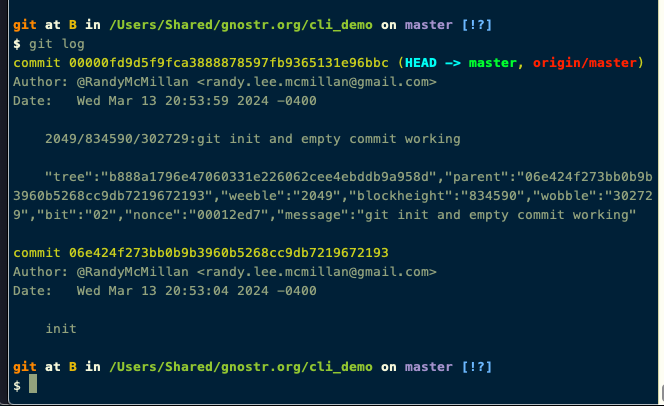
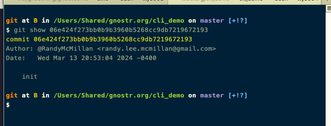

# cli_demo

## contruct an empty git commit

```shell
make cargo-i
```

```shell
mkdir test_folder && cd test_folder && cli-demo
```



```shell
git log
```

#### Initial commit




```shell
git show 06e424f273bb0b9b3960b5268cc9db7219672193

```
